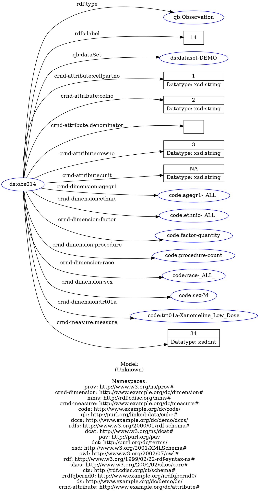

Graphical display of results from SPARQL scripts for the demographics cube (DC-DEMO-sample.ttl)
===============================================================================================

The examples below uses `arq` from Apache Jena (<http://jena.apache.org>). To install arq - download and unpack the latest version of apache-jena from (<http://jena.apache.org/download/index.cgi>). Put the executable `arq` in the path, or invoke `arq` with the full path to the directory with arq.

The use of arq is described many places, see for example (<http://www.learningsparql.com/>).

All `arq` commands below are to be run in the directory with the sample files, which is `inst/extdata/sample-rdf` directory or `extdata/sample-rdf` depending on the whether the development version or the installed version of the package is used.

The cd below in each code block is included because I could not find a quick way to get the code chunk executed in that directory. knitr is flexible enough to do it, I have not yet found the right way to do it. So, ignore the repeated cd ..

Get one observation and display graphically
-------------------------------------------

The SPARQL query returns all triples for one observation, and stores it in the file `fordot.ttl`. The file is used as input to `rapper` and converted to the dot format, and displayed using the `dot` program part of Graphviz (<http://www.graphviz.org/>).

``` bash
cd ../extdata/sample-rdf
arq --data DC-DEMO-sample.ttl --query OneQBobservation.rq > fordot.ttl
cat fordot.ttl
rapper -i turtle -o dot fordot.ttl > fordot.dot
dot -x -Tpdf -ograph.pdf fordot.dot
```

    ## @prefix dccs:  <http://www.example.org/dc/demo/dccs/> .
    ## @prefix code:  <http://www.example.org/dc/code/> .
    ## @prefix sdtms-1-3: <http://rdf.cdisc.org/sdtm-1-3/schema#> .
    ## @prefix adam-2-1: <http://rdf.cdisc.org/std/adam-2-1#> .
    ## @prefix owl:   <http://www.w3.org/2002/07/owl#> .
    ## @prefix xsd:   <http://www.w3.org/2001/XMLSchema#> .
    ## @prefix sdtm-1-3: <http://rdf.cdisc.org/std/sdtm-1-3#> .
    ## @prefix cdash-1-1: <http://rdf.cdisc.org/std/cdash-1-1#> .
    ## @prefix skos:  <http://www.w3.org/2004/02/skos/core#> .
    ## @prefix rdfs:  <http://www.w3.org/2000/01/rdf-schema#> .
    ## @prefix adamvr-1-2: <http://rdf.cdisc.org/std/adamvr-1-2#> .
    ## @prefix crnd-attribute: <http://www.example.org/dc/attribute#> .
    ## @prefix sdtm-1-2: <http://rdf.cdisc.org/std/sdtm-1-2#> .
    ## @prefix ds:    <http://www.example.org/dc/demo/ds/> .
    ## @prefix sdtmct: <http://rdf.cdisc.org/sdtm-terminology#> .
    ## @prefix qb:    <http://purl.org/linked-data/cube#> .
    ## @prefix mms:   <http://rdf.cdisc.org/mms#> .
    ## @prefix crnd-dimension: <http://www.example.org/dc/dimension#> .
    ## @prefix dct:   <http://purl.org/dc/terms/> .
    ## @prefix cdiscs: <http://rdf.cdisc.org/std/schema#> .
    ## @prefix cdashct: <http://rdf.cdisc.org/cdash-terminology#> .
    ## @prefix dcat:  <http://www.w3.org/ns/dcat#> .
    ## @prefix prov:  <http://www.w3.org/ns/prov#> .
    ## @prefix sdtmig-3-1-3: <http://rdf.cdisc.org/std/sdtmig-3-1-3#> .
    ## @prefix crnd-measure: <http://www.example.org/dc/measure#> .
    ## @prefix adamig-1-0: <http://rdf.cdisc.org/std/adamig-1-0#> .
    ## @prefix cts:   <http://rdf.cdisc.org/ct/schema#> .
    ## @prefix pav:   <http://purl.org/pav> .
    ## @prefix sdtmig-3-1-2: <http://rdf.cdisc.org/std/sdtmig-3-1-2#> .
    ## @prefix sendig-3-0: <http://rdf.cdisc.org/std/sendig-3-0#> .
    ## @prefix adamct: <http://rdf.cdisc.org/adam-terminology#> .
    ## @prefix rdf:   <http://www.w3.org/1999/02/22-rdf-syntax-ns#> .
    ## @prefix sendct: <http://rdf.cdisc.org/send-terminology#> .
    ## @prefix rrdfqbcrnd0: <http://www.example.org/rrdfqbcrnd0/> .
    ## @prefix dc:    <http://purl.org/dc/elements/1.1/> .
    ## 
    ## ds:obs014  a                        qb:Observation ;
    ##         rdfs:comment                "Statistic for number of records/Statistics for factor with the dimensions XX"@en ;
    ##         rdfs:label                  "14" ;
    ##         qb:dataSet                  ds:dataset-DEMO ;
    ##         crnd-attribute:cellpartno   "1" ;
    ##         crnd-attribute:colno        "2" ;
    ##         crnd-attribute:denominator  "" ;
    ##         crnd-attribute:measurefmt   "%6.0f" ;
    ##         crnd-attribute:rowno        "3" ;
    ##         crnd-attribute:unit         "NA" ;
    ##         crnd-dimension:agegr1       code:agegr1-_ALL_ ;
    ##         crnd-dimension:ethnic       code:ethnic-_ALL_ ;
    ##         crnd-dimension:factor       code:factor-quantity ;
    ##         crnd-dimension:procedure    code:procedure-count ;
    ##         crnd-dimension:race         code:race-_ALL_ ;
    ##         crnd-dimension:sex          code:sex-M ;
    ##         crnd-dimension:trt01a       code:trt01a-Xanomeline_Low_Dose ;
    ##         crnd-measure:measure        "34"^^xsd:double .
    ## rapper: Parsing URI file:///home/ma/projects/rrdfqbcrnd/rrdfqbcrndex/inst/extdata/sample-rdf/fordot.ttl with parser turtle
    ## rapper: Serializing with serializer dot
    ## rapper: Parsing returned 18 triples

The pdf file can then be viewed using a pdf viewer.

Alternatively, knitr supports presenting dot as show below.




<!-- ```{r cache=FALSE} -->
<!-- knitr::read_chunk("../extdata/sample-rdf/fordot.dot") -->
<!-- ``` -->
<!-- ```{r unnamed-chunk-2, engine ='dot', fig.cap ='SPARQL query'} -->
<!-- ``` -->
<!-- cd ../extdata/sample-rdf -->
<!-- arq --data DC-DEMO-sample.ttl --query OneQBobservation.rq > fordot.ttl -->
<!-- rapper -q -i turtle -o dot fordot.ttl -->
